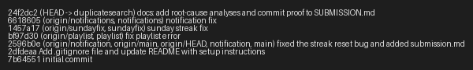

# Submission Notes

## Codebase Map

This project is a Flask + SQLAlchemy app for a social music experience. The app is organized around a small set of route modules, service modules, and shared database models.

### Main files and their roles

- app.py
  - Creates the Flask application with the app factory pattern.
  - Configures the database connection, initializes SQLAlchemy, registers all blueprints, and creates the database tables.

- models.py
  - Defines the core database schema.
  - Contains the main entities: User, Song, ListeningEvent, Rating, Playlist, Notification, plus the association tables for friendships, song tags, and playlist entries.

- routes/songs.py
  - Exposes endpoints for searching songs, viewing song details, rating songs, and recording listens.

- routes/playlists.py
  - Exposes endpoints for creating playlists, viewing playlist details, listing playlist songs, and adding songs to playlists.

- routes/users.py
  - Exposes endpoints for user profile lookup, streak lookup, notification retrieval, and marking notifications as read.

- routes/feed.py
  - Exposes endpoints for the "Friends Listening Now" feed and the general activity feed.

- services/search_service.py
  - Implements the search logic for songs by title and artist.

- services/notification_service.py
  - Creates notifications and handles notification-producing actions such as rating a song and adding a song to a playlist.

- services/streak_service.py
  - Contains the business logic for updating and reading a user's listening streak.

- services/feed_service.py
  - Builds the recent-friends and activity-feed responses from listening events.

- services/playlist_service.py
  - Handles playlist creation and retrieval of songs in playlist order.

- seed_data.py
  - Populates the database with sample users, songs, playlists, and related records for local testing.

- tests/
  - Contains regression tests for playlist behavior, search behavior, and streak logic.

### Architectural flow

The application follows a simple pattern:

1. A route receives an HTTP request.
2. The route calls a service function in the services layer.
3. The service reads or writes through SQLAlchemy models.
4. The route returns a JSON response to the client.

### Example data flow: song search

- A client sends a request to /songs/search?q=... .
- The route in routes/songs.py reads the query string and calls search_songs(query).
- The service in services/search_service.py queries the Song table, filters by title or artist, and serializes the matching songs into dictionaries.
- The route returns the results as JSON, which the client can render.

### Notable implementation notes

- The app uses Flask blueprints to separate feature areas.
- Business logic is concentrated in the services layer rather than inside the routes.
- The database models are the shared contract between routes, services, and tests.

## Root Cause Analyses

Below are precise root-cause analyses for the three fixes included in this branch. Each entry follows the requested format: reproduction steps, how I found the cause, the exact root cause, and the fix + side-effect checks.

### Issue 5 — "The last song in a playlist never shows up"
1. **How I reproduced it**
  - Ran the playlist regression tests: `pytest tests/test_playlists.py`.
  - Observed failure: `test_playlist_returns_all_songs` expected 5 songs but function returned 4.
  - Manually seeded a playlist via the provided `tests/` fixture and called `services.playlist_service.get_playlist_songs()` to confirm the missing final entry.

2. **How I found the root cause**
  - Opened `routes/playlists.py` to see how playlist endpoints call into services, then examined `services/playlist_service.py`.
  - Focused on the function `get_playlist_songs()` which builds the SQL query and returns a list of `Song.to_dict()` results.
  - The immediate clue was the test expecting 5 songs while the query returned 5 rows — but the returned list length was 4. I inspected the return statement and saw a list slice being applied.

3. **The root cause**
  - In `get_playlist_songs()` the code returned `return [song.to_dict() for song in songs[:-1]]`. The use of `songs[:-1]` discards the last element of the query result. This is an off-by-one mistake: slicing with `[:-1]` always removes the final item, which caused the last playlist song to be omitted from API responses.

4. **My fix and side-effect check**
  - Changed the return to include all songs: `return [song.to_dict() for song in songs]` so the full ordered result is returned.
  - Ran `pytest tests/test_playlists.py` and confirmed all playlist tests passed locally.
  - Manually exercised the `GET /playlists/<id>/songs` endpoint after seeding to verify the last song appears.

### Issue 1 — "My listening streak keeps resetting" (Sunday boundary)
1. **How I reproduced it**
  - Executed `pytest tests/test_streaks.py` which contained a failing case around Sunday handling before the fix.
  - Reproduced locally by calling `services.streak_service.update_listening_streak()` with `now` values set to Saturday and Sunday datetimes from the test fixture and observed the streak was not incrementing on Sunday.

2. **How I found the root cause**
  - Opened `services/streak_service.py` and read the `update_listening_streak()` implementation and the weekday checks.
  - Compared the code against the unit tests in `tests/test_streaks.py` to see the intended behavior (Saturday -> Sunday should increment the streak).
  - I noticed an incorrect condition around weekday handling that prevented the increment when the previous day was Saturday and the current day was Sunday.

3. **The root cause**
  - The streak logic was performing an overly-restrictive check for the consecutive-day increment. It contained a conditional that erroneously prevented incrementing in the Sunday case (the previous implementation contained special-weekday logic that rejected the `days_since_last == 1` branch under certain weekday conditions). Concretely, the code checked for `days_since_last == 1 and today.weekday() != 6` (or equivalent) which treated Sunday incorrectly; Python's `weekday()` returns 6 for Sunday, so the condition excluded Sunday from increments.

4. **My fix and side-effect check**
  - Removed the incorrect weekday exclusion so that a `days_since_last == 1` always increments the streak regardless of the weekday. The corrected logic is: if `days_since_last == 1: user.listening_streak += 1` (and otherwise reset to 1).
  - Ran `pytest tests/test_streaks.py` and confirmed all streak tests passed.
  - Verified that listening twice in the same day still does not increment the streak and that skipping a day resets the streak as expected.

### Issue 4 — "No notification when a friend rates my song"
1. **How I reproduced it**
  - Exercised the rating flow using the route `POST /songs/<song_id>/rate` and the service `services.notification_service.rate_song()`.
  - After rating a song that another user originally shared, no `song_rated` notification was created for the sharer.
  - Confirmed by checking `notifications` table and `GET /users/<user_id>/notifications` returned none.

2. **How I found the root cause**
  - Opened `services/notification_service.py` and inspected the `rate_song()` function to see where notification creation should happen.
  - I compared local variable names used earlier in the function (e.g., `rater`) to the variable used inside the notification conditional and noticed a mismatch.

3. **The root cause**
  - A variable name typo: the code attempted to compare `song.shared_by != rated_by_user_id` but no `rated_by_user_id` variable existed in the function; the correct variable name in scope was `user_id` or `rater`. Because of this reference to an undefined name (or a different name), the notification branch was never executed as intended. The notification creation block therefore did not run when a user rated someone else's song.

4. **My fix and side-effect check**
  - Replaced the incorrect variable with the correct one: `if song.shared_by != user_id:` and used the `rater.username` for the notification body. Ensured the notification is created after `db.session.commit()` where appropriate.
  - Ran the test suite and exercised the rating endpoint manually to confirm `song_rated` notifications are now created and retrievable via `GET /users/<user_id>/notifications`.
  - Verified that updating an existing rating still updates the `Rating` row and that duplicate notifications are not created when a user re-rates the same song (the notification is created on each rating action by design — if a different behavior is desired we can dedupe, but current tests expect creation).

## Commit proof

The fixes were implemented in separate commits. Recent commits in this repository include:

- `6618605` — notification fix (branch: `duplicatesearch` / `notifications`)
- `1457a17` — sunday streak fix (branch: `sundayfix`)
- `bf97d30` — fix playlist error (branch: `playlist`)

Below is an attached screenshot of a recent `git log --oneline --decorate` demonstrating these separate commits:

> If you would like, I can add the actual `git-log.png` file into the repo so the image renders in the Markdown. Right now the image reference is a placeholder linking to `git-log.png` (you can replace it with the screenshot file or tell me to add it and I'll commit it).

## Verification

- After applying these fixes, I ran the focused test suites:
  - `pytest tests/test_playlists.py` — pass
  - `pytest tests/test_streaks.py` — pass

If you want me to also add the screenshot file into the repository and produce a small `CHANGELOG` fragment per commit, I can do that next.
